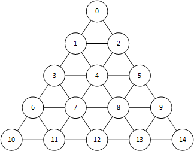
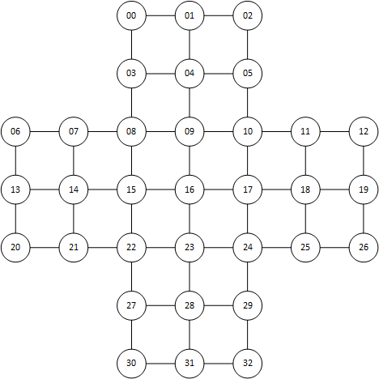

# jump #
## Classic jump game ##
In the U.S. there is a chain of restaurants called Cracker Barrel.  They have at each table (or did before COVID) a little game that helps distract people while they're waiting to have their order taken or brought to them or for the check to be presented to them.  The game consists of a piece of wood in the shape of an equalateral triangle.  In the wood are drilled 15 holes spaced at the vertices of a trianglular tesselation of the larger triangle.  The figure below shows an adjacency graph of the board

The game is played by placing pegs (usually golf tees) into all but one of the holes.  The player selects a peg and moves it by jumping over an adjacent peg into a vacant hole and removes the peg which was jumped.  Play continues until no moves remain.  A winning game concludes when only one peg remains on the board. An example of a winning game can be seen on [YouTube](https://www.youtube.com/watch?v=v9uGQj1adsA) (where there are likely many others).  Bonus points were earned if the final peg is in the hole which started out as empty.

When I was a child, my grandparents had a variation on this game where the board consisted of 33 holes arranged into a cross.  The center hole started as empty and the objective was essentially the same as the triangular version of the game... finish with only one peg.  My grandmother had severe rhumatoid arthritis in her hands and manipulating the pegs was theraputic for her.  She is the only person I know who could consistently solve this 33 hole variation.

## Solver ##
The program in this project reads a set of files which defines the adjacency graph, a starting position and a desired end state.  It will then find either a single sequence of moves which from the starting position concluding with the desired end state, or all such sequence of moves. (Note to self... maybe have a setting to limit the number of solutions to return)

There are three files needed to define the board (well, really just two; the third is to support visualization, but I haven't done anything with visualization yet).

### Configuration JSON file ###

The main configuration is contained in a JSON file (Note to self... maybe allow defining in either JSON or YAML).  A sample JSON file is provided in [cracker_standard.json](resources/cracker_standard.json).  THe JSON file may contain the following fields (some of which are optional):

#### description ####
This is a string value describing the board.  If omitted, a generic description is given

#### board ###
This is a string value containng the name of the CSV file containing the adjacency graph.  The file name can either a path relative to the location of the JSON file, or an absolute path.  The structure of the file is described in more detail below.

#### layout ####
This is a string containing the name of the CSV file containing the coordinates of the hole locations.  Again, this can either be a path relative to the location of the JSON file, or an absolute path.  The holes are currently limited to an 2D locations, though I may later extend this to a 3D location set to do things like covering a sphere or torus... again something to do later.  The structure of the file is described in additional detail below.

#### start ####
This is a list of non-negative integer values describing the starting location of the pegs.  Each number present in the list indicates a vertex into which a peg is initially placed.  Any number missing does not have a peg at the start of the game.

#### method ####
The solver implements two search methods, depth first and breadth first.  If omitted, depth first search is used.  This field is limited to exactly one of the string values "DEPTH_FIRST" or "BREADTH_FIRST".  This is not case sensitive, so feel free to mix up the letter case to your heart's content.

#### scope ####
This is a string value, either "SINGLE" or "MULTIPLE" (again not case sensitive) describing whether to return only one solution, or to return all of them.  (Note to self... this should probably be replaces with a "max_solution_count" in the future).

#### finish ####
This is a list of non-negative integeres describing the location of pegs in the desired solution.  If both this field and the *final_count* fields are missing, this defaults to the list of vertices which do not appear in the start list.  When specified (either explicitly or implicitly) one or more solutions (if any exist) are returned showing the steps to take to achieve the finish state after starting in the start states.

#### finish_count ####
When present, this is a positive integer.  It may be omitted, in which case the (implicit or explicit) *finish* field is used to describe the desired solution state. If both the *finish_count* and *finish* fields are present, the *finish* state used.  When the *finish_count* field is used, it defines the number of pegs the solution should have with no additional moves possible.  So, if given the number 2, and a state with 2 pegs remaining is not considered a solution if one can jump the other.

### Board CSV File ###
The board CSV file specifies the adjacency graph of the board.  Its rows refer to a particular board position, and the columns represent a direction.  The value in the table is vertex index adjacent to the row's vertex if travel in the column direction is made.  When the value is not given, no move in the direction from the vertex is possible.  The [cracker_board.csv](resources/cracker_board.csv) file specifies the board adjacency for the Cracker Barrel board previously described.

### Layout CSV File ###
The layout CSV file specifies the physical layout of the holes in the board.  This is for rendering purposes, and so is not currently used.  You can use whatever offset or scaling you like, as long as the positions are proportional to the locations you want on the display.  The program will compute the minimum enclosing circle of the points and then translate and scale the points so they are all positioned within the unit circle after reading them from the file.  A sample layout for the Cracker Barrel board is given in [cracker_layout.csv](resources/cracker_layout.csv)

### Results ###
Currently, the program produces the solutions found, along with an indication of the number of solutions found.